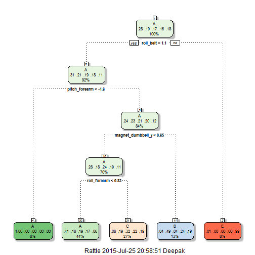

## Synopsis: 

Using devices such as Jawbone Up, Nike FuelBand, and Fitbit it is now possible to collect a large amount of data about personal activity relatively inexpensively. These type of devices are part of the quantified self movement - a group of enthusiasts who take measurements about themselves regularly to improve their health, to find patterns in their behavior, or because they are tech geeks. One thing that people regularly do is quantify how much of a particular activity they do, but they rarely quantify how well they do it.

The approach proposed for the Weight Lifting Exercises dataset is to investigate "how (well)" an activity was performed by the wearer. The "how (well)" investigation has only received little attention so far, even though it potentially provides useful information for a large variety of applications,such as sports training.

Six young health participants were asked to perform one set of 10 repetitions of the Unilateral Dumbbell Biceps Curl in five different fashions: 
*Class A: exactly according to the specification, 
*Class B: throwing the elbows to the front 
*Class C: lifting the dumbbell only halfway 
*Class D: lowering the dumbbell only halfway 
*Class E: throwing the hips to the front

Class A corresponds to the specified execution of the exercise, while the other 4 classes correspond to common mistakes.


Velloso, E.; Bulling, A.; Gellersen, H.; Ugulino, W.; Fuks, H. Qualitative Activity Recognition of Weight Lifting Exercises. Proceedings of 4th International Conference in Cooperation with SIGCHI (Augmented Human '13) . Stuttgart, Germany: ACM SIGCHI, 2013.

Read more: http://groupware.les.inf.puc-rio.br/har#wle_paper_section


## Question: 
Using the training and test data provided by accelrometers on arm, waistband  and dumbell of participants, how well can we predict the activity quality (Class A-E) on an out of sample observation?

###Load Libraries

```r
library(AppliedPredictiveModeling)
library(caret)
library(rattle)
library(rpart.plot)
library(randomForest)
```

## Input Data:

First we import the data and identify whether train and test data have identical columns/variables


```r
setwd("C:\\Me\\Projects\\PML-WeightLifting")
training_url = "https://d396qusza40orc.cloudfront.net/predmachlearn/pml-training.csv"
training_file = "pml-training.csv"
if (!file.exists(training_file)){download.file(url=testing_url, destfile=training_file)}

testing_url = "https://d396qusza40orc.cloudfront.net/predmachlearn/pml-testing.csv"
testing_file = "pml-testing.csv"
if (!file.exists(testing_file)) {download.file(url=testing_url, destfile=testing_file)}

# Import the data and convert blanks and DIV errors as NA.
train = read.csv("pml-training.csv", na.strings=c('NA','','#DIV/0!'), header=TRUE)
train_cols = colnames(train)
test = read.csv("pml-testing.csv", na.strings=c('NA','','#DIV/0!'), header=TRUE)
test_cols = colnames(test)

# Verify that the column names (excluding classe and problem_id) are identical in the training and test set.
all.equal(train_cols[1:length(train_cols)-1], test_cols[1:length(test_cols)-1])
```

```
## [1] TRUE
```

##Features


```r
#Remove NA columns from training and test dataset

NAindex = apply(train,2,function(x) {sum(is.na(x))}) 
trainNA = train[,which(NAindex == 0)]
testNA = test[,which(NAindex == 0)]

train_cols = colnames(trainNA)
test_cols = colnames(testNA)
all.equal(train_cols[1:length(train_cols)-1], test_cols[1:length(test_cols)-1])
```

```
## [1] TRUE
```

```r
#Remove unnecessary columns like timestamps, usernames, etc
trainNA = trainNA[,8:length(names(trainNA))]
testNA = testNA[,8:length(names(testNA))]

#center and scale the variables
#numvect = which(lapply(trainNA, class) %in% "numeric")

preproc = preProcess(trainNA[,-53],method=c('center', 'scale'))
trainproc = predict(preproc, trainNA[,-53])
trainproc$classe = trainNA$classe

testproc = predict(preproc,testNA[,-53])

#identify near zero variables that have virtually no variability
nzw = nearZeroVar(trainproc, saveMetrics=TRUE)
nzw
```

```
##                      freqRatio percentUnique zeroVar   nzv
## roll_belt             1.101904     6.7781062   FALSE FALSE
## pitch_belt            1.036082     9.3772296   FALSE FALSE
## yaw_belt              1.058480     9.9734991   FALSE FALSE
## total_accel_belt      1.063160     0.1477933   FALSE FALSE
## gyros_belt_x          1.058651     0.7134849   FALSE FALSE
## gyros_belt_y          1.144000     0.3516461   FALSE FALSE
## gyros_belt_z          1.066214     0.8612782   FALSE FALSE
## accel_belt_x          1.055412     0.8357966   FALSE FALSE
## accel_belt_y          1.113725     0.7287738   FALSE FALSE
## accel_belt_z          1.078767     1.5237998   FALSE FALSE
## magnet_belt_x         1.090141     1.6664968   FALSE FALSE
## magnet_belt_y         1.099688     1.5187035   FALSE FALSE
## magnet_belt_z         1.006369     2.3290184   FALSE FALSE
## roll_arm             52.338462    13.5256345   FALSE FALSE
## pitch_arm            87.256410    15.7323412   FALSE FALSE
## yaw_arm              33.029126    14.6570176   FALSE FALSE
## total_accel_arm       1.024526     0.3363572   FALSE FALSE
## gyros_arm_x           1.015504     3.2769341   FALSE FALSE
## gyros_arm_y           1.454369     1.9162165   FALSE FALSE
## gyros_arm_z           1.110687     1.2638875   FALSE FALSE
## accel_arm_x           1.017341     3.9598410   FALSE FALSE
## accel_arm_y           1.140187     2.7367241   FALSE FALSE
## accel_arm_z           1.128000     4.0362858   FALSE FALSE
## magnet_arm_x          1.000000     6.8239731   FALSE FALSE
## magnet_arm_y          1.056818     4.4439914   FALSE FALSE
## magnet_arm_z          1.036364     6.4468454   FALSE FALSE
## roll_dumbbell         1.022388    84.2065029   FALSE FALSE
## pitch_dumbbell        2.277372    81.6685353   FALSE FALSE
## yaw_dumbbell          1.132231    83.4828254   FALSE FALSE
## total_accel_dumbbell  1.072634     0.2191418   FALSE FALSE
## gyros_dumbbell_x      1.003268     1.2282132   FALSE FALSE
## gyros_dumbbell_y      1.264957     1.4167771   FALSE FALSE
## gyros_dumbbell_z      1.060100     1.0498420   FALSE FALSE
## accel_dumbbell_x      1.018018     2.1659362   FALSE FALSE
## accel_dumbbell_y      1.053061     2.3748853   FALSE FALSE
## accel_dumbbell_z      1.133333     2.0894914   FALSE FALSE
## magnet_dumbbell_x     1.098266     5.7486495   FALSE FALSE
## magnet_dumbbell_y     1.197740     4.3012945   FALSE FALSE
## magnet_dumbbell_z     1.020833     3.4451126   FALSE FALSE
## roll_forearm         11.589286    11.0895933   FALSE FALSE
## pitch_forearm        65.983051    14.8557741   FALSE FALSE
## yaw_forearm          15.322835    10.1467740   FALSE FALSE
## total_accel_forearm   1.128928     0.3567424   FALSE FALSE
## gyros_forearm_x       1.059273     1.5187035   FALSE FALSE
## gyros_forearm_y       1.036554     3.7763735   FALSE FALSE
## gyros_forearm_z       1.122917     1.5645704   FALSE FALSE
## accel_forearm_x       1.126437     4.0464784   FALSE FALSE
## accel_forearm_y       1.059406     5.1116094   FALSE FALSE
## accel_forearm_z       1.006250     2.9558659   FALSE FALSE
## magnet_forearm_x      1.012346     7.7667924   FALSE FALSE
## magnet_forearm_y      1.246914     9.5403119   FALSE FALSE
## magnet_forearm_z      1.000000     8.5771073   FALSE FALSE
## classe                1.469581     0.0254816   FALSE FALSE
```

As can be seen there are no zero variables; all nzw values are false. 


##Model

###Validation Data Set

We are provided with a training set (19,622 obs) and test set(20 obs). Create a validation set out of the training set in a 60%-40% ratio.


```r
set.seed(12031987)

inTrain = createDataPartition(trainproc$classe, p = 0.6, list=FALSE)
training = trainproc[inTrain,]
crossValidation = trainproc[-inTrain,]
nrow(training)
```

```
## [1] 11776
```

```r
nrow(crossValidation)
```

```
## [1] 7846
```

I have decided to try classification trees and random forest based on their accuracy of prediction.

##Evaluation

###Classification Trees

```r
modFit <- train(classe ~ ., data = training, method="rpart")
print(modFit, digits=3)
```

```
## CART 
## 
## 11776 samples
##    52 predictor
##     5 classes: 'A', 'B', 'C', 'D', 'E' 
## 
## No pre-processing
## Resampling: Bootstrapped (25 reps) 
## 
## Summary of sample sizes: 11776, 11776, 11776, 11776, 11776, 11776, ... 
## 
## Resampling results across tuning parameters:
## 
##   cp      Accuracy  Kappa   Accuracy SD  Kappa SD
##   0.0346  0.515     0.3707  0.0467       0.0752  
##   0.0583  0.395     0.1748  0.0528       0.0885  
##   0.1151  0.319     0.0539  0.0403       0.0620  
## 
## Accuracy was used to select the optimal model using  the largest value.
## The final value used for the model was cp = 0.0346.
```


```r
print(modFit$finalModel, digits=3)
```

```
## n= 11776 
## 
## node), split, n, loss, yval, (yprob)
##       * denotes terminal node
## 
##  1) root 11776 8430 A (0.28 0.19 0.17 0.16 0.18)  
##    2) roll_belt< 1.05 10788 7450 A (0.31 0.21 0.19 0.18 0.11)  
##      4) pitch_forearm< -1.59 930    4 A (1 0.0043 0 0 0) *
##      5) pitch_forearm>=-1.59 9858 7440 A (0.24 0.23 0.21 0.2 0.12)  
##       10) magnet_dumbbell_y< 0.647 8270 5920 A (0.28 0.18 0.24 0.19 0.11)  
##         20) roll_forearm< 0.83 5145 3040 A (0.41 0.18 0.19 0.17 0.057) *
##         21) roll_forearm>=0.83 3125 2110 C (0.077 0.19 0.32 0.22 0.19) *
##       11) magnet_dumbbell_y>=0.647 1588  817 B (0.042 0.49 0.04 0.24 0.19) *
##    3) roll_belt>=1.05 988    9 E (0.0091 0 0 0 0.99) *
```


```r
fancyRpartPlot(modFit$finalModel)
```

 

Predictions on the Vaidation Set


```r
predtree = predict(modFit, newdata=crossValidation)
print(confusionMatrix(predtree, crossValidation$classe), digits=4)
```

```
## Confusion Matrix and Statistics
## 
##           Reference
## Prediction    A    B    C    D    E
##          A 2028  633  603  579  222
##          B   41  549   51  220  194
##          C  158  336  714  487  374
##          D    0    0    0    0    0
##          E    5    0    0    0  652
## 
## Overall Statistics
##                                           
##                Accuracy : 0.5025          
##                  95% CI : (0.4914, 0.5137)
##     No Information Rate : 0.2845          
##     P-Value [Acc > NIR] : < 2.2e-16       
##                                           
##                   Kappa : 0.3499          
##  Mcnemar's Test P-Value : NA              
## 
## Statistics by Class:
## 
##                      Class: A Class: B Class: C Class: D Class: E
## Sensitivity            0.9086  0.36166   0.5219   0.0000  0.45215
## Specificity            0.6372  0.92004   0.7908   1.0000  0.99922
## Pos Pred Value         0.4989  0.52038   0.3451      NaN  0.99239
## Neg Pred Value         0.9460  0.85731   0.8868   0.8361  0.89011
## Prevalence             0.2845  0.19347   0.1744   0.1639  0.18379
## Detection Rate         0.2585  0.06997   0.0910   0.0000  0.08310
## Detection Prevalence   0.5181  0.13446   0.2637   0.0000  0.08374
## Balanced Accuracy      0.7729  0.64085   0.6564   0.5000  0.72568
```


###Random Forest

Train the model on training data set with method cross validation 


```r
modFitrf <- train(classe ~., method="rf", data=training, trControl=trainControl(method='cv'), number=5, allowParallel=TRUE )
print(modFitrf, digits=3)
```

```
## Random Forest 
## 
## 11776 samples
##    52 predictor
##     5 classes: 'A', 'B', 'C', 'D', 'E' 
## 
## No pre-processing
## Resampling: Cross-Validated (10 fold) 
## 
## Summary of sample sizes: 10598, 10599, 10600, 10598, 10598, 10599, ... 
## 
## Resampling results across tuning parameters:
## 
##   mtry  Accuracy  Kappa  Accuracy SD  Kappa SD
##    2    0.990     0.987  0.00429      0.00543 
##   27    0.990     0.987  0.00342      0.00433 
##   52    0.983     0.979  0.00445      0.00562 
## 
## Accuracy was used to select the optimal model using  the largest value.
## The final value used for the model was mtry = 2.
```

Predictions on validation data set

```r
predrf <- predict(modFitrf, newdata=crossValidation)
print(confusionMatrix(predrf, crossValidation$classe), digits=4)
```

```
## Confusion Matrix and Statistics
## 
##           Reference
## Prediction    A    B    C    D    E
##          A 2228    4    0    0    0
##          B    2 1507    9    0    0
##          C    0    7 1357   22    0
##          D    0    0    2 1260    1
##          E    2    0    0    4 1441
## 
## Overall Statistics
##                                           
##                Accuracy : 0.9932          
##                  95% CI : (0.9912, 0.9949)
##     No Information Rate : 0.2845          
##     P-Value [Acc > NIR] : < 2.2e-16       
##                                           
##                   Kappa : 0.9915          
##  Mcnemar's Test P-Value : NA              
## 
## Statistics by Class:
## 
##                      Class: A Class: B Class: C Class: D Class: E
## Sensitivity            0.9982   0.9928   0.9920   0.9798   0.9993
## Specificity            0.9993   0.9983   0.9955   0.9995   0.9991
## Pos Pred Value         0.9982   0.9928   0.9791   0.9976   0.9959
## Neg Pred Value         0.9993   0.9983   0.9983   0.9961   0.9998
## Prevalence             0.2845   0.1935   0.1744   0.1639   0.1838
## Detection Rate         0.2840   0.1921   0.1730   0.1606   0.1837
## Detection Prevalence   0.2845   0.1935   0.1767   0.1610   0.1844
## Balanced Accuracy      0.9987   0.9955   0.9937   0.9897   0.9992
```

#Conclusion

Classification Trees
  	        Accuracy
Training		0.515
Validation	0.5025


Random Forests
		        Accuracy
Training		0.990
Validation	0.9932

As can be seen from the above analysis, the Random Forest model has the best accuracy.
Use this model to predict on the test set.

The out of sample error rate is 1 - 0.9932 = 0.0068


```r
# Run against testing set.
predtest <- predict(modFitrf, newdata=testproc)
predtest
```

```
##  [1] B A B A A E D B A A B C B A E E A B B B
## Levels: A B C D E
```


#Appendix

Code to Generate the files for submission

```r
pml_write_files = function(x){
  n = length(x)
  for(i in 1:n){
    filename = paste0("problem_id_",i,".txt")
    write.table(x[i],file=filename,quote=FALSE,row.names=FALSE,col.names=FALSE)
  }
}

pml_write_files(predtest)
```

